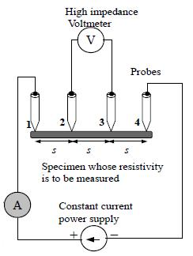
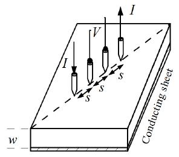
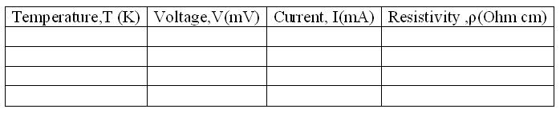

### Apparatus

The experimental setup consists of a four-probe arrangement, a semiconductor sample, an oven (0–200°C), a constant current source, an oven power supply, and digital panel meters to measure voltage and current.

The four-probe method is a widely used technique for measuring the resistivity of semiconductor materials. In this method, four equally spaced probes are placed in a straight line on the surface of the sample. A constant current is passed through the two outer probes, while the voltage drop across the two inner probes is measured. Using the measured current and voltage, the resistivity of the sample is determined.

The sample is placed inside an oven so that its temperature can be varied. By measuring the resistivity at different temperatures, the effect of temperature on the electrical properties of the semiconductor can be studied.

Figure 1

Figure 2

The figure shows the arrangements of four probes that measure voltage (V) and supply current (A) to the surface of the crystal.

### Procedure for Simulation

1. Select the semiconductor material from the **Select Material** drop-down list.

2. Select the required **Current Range**.

3. Adjust the **Current Slider** to set the desired current.

4. Select the **Oven Range**.

5. Set the required temperature using the **Temperature Slider**.

6. Click **Set** to fix the selected temperature.

7. Click **Run** to heat the sample from room temperature to the selected temperature.

8. Click **Wait** to stop heating at the desired temperature.

9. Click **Measure** to display the current temperature of the sample.

10. Select the appropriate **Voltmeter Range**.

11. Note the voltage (V) displayed on the voltmeter.

12. Repeat the experiment for different temperatures.

13. Calculate the resistivity of the semiconductor using the equations given below.

14. Observe the graph of **Temperature** versus **Resistivity**.

---

## Procedure for Real Laboratory

1. Place the four probes on the semiconductor sample as shown in the figure.

2. Connect the outer two probes to the constant current source.

3. Set the source current to **8 mA**.

4. Measure the voltage across the inner two probes using the digital voltmeter.

5. Place the sample inside the oven.

6. Increase the temperature gradually and record the voltage at different temperatures.

7. Measure the distance between adjacent probes (**S**) and the thickness of the sample (**w**).

8. Calculate the value of **w/S** and obtain the correction factor **f(w/S)** from the standard table.

9. Calculate the resistivity of the semiconductor for each temperature.

### Observations and Calculations

**Given:**

- Distance between adjacent probes:

  $$S = 0.2\ \text{cm}$$

- Thickness of the sample:

  $$w = 0.05\ \text{cm}$$

- Correction factor:

  $$f\left(\frac{w}{S}\right)=5.89$$

### Step 1: Calculate the Uncorrected Resistivity

$$
\rho_0=\frac{V}{I}\times2\pi S
$$

where

- $$V$$ = Measured voltage
- $$I$$ = Current through the sample
- $$S$$ = Distance between adjacent probes

### Step 2: Calculate the Resistivity

$$
\rho=\frac{\rho_0}{f\left(\frac{w}{S}\right)}
$$

$\rho = \frac{\rho_0}{f\left(\frac{w}{s}\right)}$ = ...........Ohm cm

$\rho_0 = \frac{V}{I} \times 2\pi S$ = ..................... Ohm cm

## Result

The resistivity of the given semiconductor sample using the **Four Probe Method** is $\rho$ = ......................... Ohm cm

