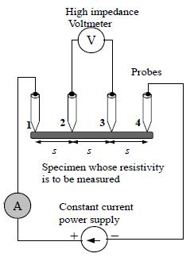
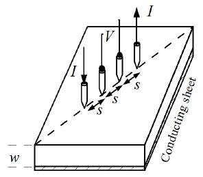
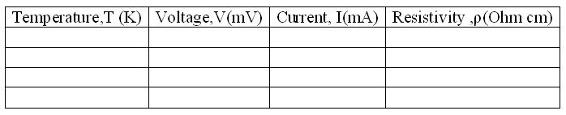

### Apparatus

The experimental set up consists of probe arrangement, sample , oven 0-200°C, constant current generator , oven power supply and digital panel meter(measuring voltage and current).

Four probe apparatus is one of the standard and most widely used apparatus for the measurement of resistivity of semiconductors.
This method  is employed when the sample is in the form of a thin wafer, such as a thin semiconductor material deposited on a substrate. The sample is millimeter in size and having a thickness w. It consists of four probe arranged linearly in a straight line at equal distance S from each other. A constant current is passed through the two probes and the potential drop V across the middle two probes is measured. An oven is provided with a heater to heat the sample so that behavior of the sample is studied with increase in temperature.

Figure 1

Figure 2

The figure shows the arrangements of four probes that measure voltage (V) and supply current (A) to the surface of the crystal.

<h3>Procedure for Simulation</h3>

<h4>Combo Box and Sliders</h4>

<strong>Select Material</strong> – Used to select the semiconductor material for simulation.

<strong>Range of Current</strong> – Choose the current range for the current source.

<strong>Current Slider</strong> – Ranges from 1 mA to 200 mA.  
<em>Note:</em> The slider has 100 fixed divisions. If 20 mA is selected in the combo box, the slider ranges from 0 mA to 20 mA with 0.2 mA intervals. If 200 mA is selected, it ranges from 0 mA to 200 mA with 2 mA intervals.

<strong>Range of Oven</strong> – Used to fix the temperature range via a combo box.

<strong>Oven</strong> – Varies the temperature up to 2000 °C. 
<ul>
  <li><strong>Set Button</strong> – Fixes the temperature in the oven.</li>
  <li><strong>Run Button</strong> – Starts heating after the temperature is set.</li>
  <li><strong>Wait Button</strong> – Stops heating the oven at a specific temperature.</li>
  <li><strong>Measure Button</strong> – Displays the current oven temperature.</li>
</ul>

<strong>Select Range Combo Box</strong> – Options: X1 and X10.

<strong>Temperature Slider</strong> – Ranges from 270 °C to 2000 °C.  
Active only after clicking the Set button and becomes inactive after clicking Run.  
If X1 is selected: slider ranges from 270 °C to 990 °C.  
If X10 is selected: slider ranges from 27 °C to 200 °C.

<strong>Voltmeter Combo Box</strong> – Options: 1 mV, 10 mV, 100 mV, 1 V, 10 V. Used to select output voltage range.

## Procedure
<ol>
  <li>Select the semiconductor material from the combo box.</li>
  <li>Select the source current using the slider based on the chosen range.</li>
  <li>Select the oven range using the combo box.</li>
  <li>Set the temperature using the temperature slider.</li>
  <li>Click the Run button to begin heating from the default 25 °C to the set temperature. Use the Wait button to stop heating.</li>
  <li>Click the Set button to display the temperature set in the oven.</li>
  <li>Click the Measure button to show the current temperature inside the oven.</li>
  <li>Select the voltmeter range from the combo box.</li>
  <li>Measure the voltage using the voltmeter.</li>
  <li>Calculate the resistivity of the semiconductor (in eV) using equations (2) and (3).</li>
  <li>A graph is plotted with temperature on the x-axis and semiconductor resistivity on the y-axis.</li>
</ol>

<h3>Procedure for Real Lab</h3>

In the real lab, four probes are placed on the sample as shown in Fig:1. Connections are made as shown in the simulator. A constant current is passed through the outer probes by connecting them to the constant current source of the setup. The current is set to <strong>8 mA</strong>.

The voltage developed across the middle two probes is measured using a digital milli-voltmeter. The trial is repeated by placing the four-probe arrangement inside the oven. The oven is connected to the heater supply of the setup. For different temperatures, up to <strong>1500 °C</strong>, the voltage developed is noted and tabulated.

The distance between the probes (<strong>S</strong>) and the thickness of the crystal (<strong>W</strong>) are measured. The values of <strong>W/S</strong> are calculated, and the value of the function <strong>f(W/S)</strong> is taken from a standard reference table.

Using equations (2) and (3), calculate <strong>&#961;</strong> (resistivity) for various temperatures.

### Observations and Calculations

Resistivity can be calculated by using the equation given below.

Here we take:

Distance between the probes, $S = 0.2\,\text{cm}$  
Thickness of the sample, $w = 0.05\,\text{cm}$  
From standard table: f(w/S) = 5.89  

$\rho = \frac{\rho_0}{f\left(\frac{w}{s}\right)}$ = ...........Ohm cm

$\rho_0 = \frac{V}{I} \times 2\pi S$ = ..................... Ohm cm

## Result

 The resistivity of the given semiconductor by Four probe Method =  ...................................Ohm cm

