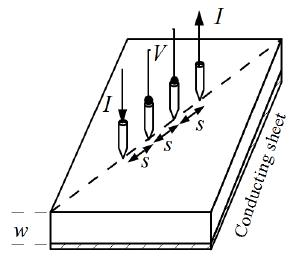

## Theory

<iframe width="560" height="315" src="https://www.youtube.com/embed/I9RmGM1kbs8" title="YouTube video player" frameborder="0" allow="accelerometer; autoplay; clipboard-write; encrypted-media; gyroscope; picture-in-picture; web-share" referrerpolicy="strict-origin-when-cross-origin" allowfullscreen></iframe>

At a constant temperature, the resistance, R of a conductor is proportional to its length L and inversely proportional to its area of cross section A. 

$$R=\rho\frac{L}{A}.........(1)$$

  
Where <strong>ρ</strong> is the resistivity of the conductor and its unit is ohm·meter.

  
A semiconductor has electrical conductivity intermediate in magnitude between that of a conductor and insulator. Semiconductor differs from metals in their characteristic property of decreasing electrical resistivity with increasing temperature.

  
According to band theory, the energy levels of semiconductors can be grouped into two bands: the valence band and the conduction band. In the presence of an external electric field, it is the electrons in the valence band that can move freely, thereby being responsible for the electrical conductivity of semiconductors.

  
In the case of intrinsic semiconductors, the Fermi level lies between the conduction band minimum and valence band maximum. Since the conduction band lies above the Fermi level at 0 K, and no thermal excitations are available, the conduction band remains unoccupied. So, conduction is not possible at 0 K, and resistance is infinite. As temperature increases, the occupancy of the conduction band goes up, thereby resulting in a decrease in the electrical resistivity of the semiconductor.

  
Figure 1: Resistivity probes on a die of material
 

  <h3>Resistivity of Semiconductor by Four Probe Method</h3>
  <ul>
    <li>The resistivity of material is uniform in the area of measurement.</li>
    <li>If there is a minority carrier injection into the semiconductor by the current-carrying electrodes, most of the carriers recombine near electrodes so that their effect on conductivity is negligible.</li>
    <li>The surface on which the probes rest is flat with no surface leakage.</li>
    <li>The four probes used for resistivity measurement contact the surface at points that lie in a straight line.</li>
    <li>The diameter of the contact between metallic probes and the semiconductor should be small compared to the distance between the probes.</li>
    <li>The boundary between the current-carrying electrodes and the bulk material is hemispherical and small in diameter.</li>
    <li>The surface of semiconductor material may be either conducting or non-conducting. A conducting boundary is one on which material of much lower resistivity than the semiconductor has been plated. A non-conducting boundary is produced when the surface of the semiconductor is in contact with an insulator.</li>
  </ul>

  
<strong>Fig 1:</strong> shows the resistivity probes on a die of material. If the side boundaries are adequately far from the probes, the die may be considered to be identical to a slice. For this case of a slice of thickness <em>w</em>, the resistivity is computed as...

  $$\rho=\frac{\rho_{0}}{f\left( \frac{w}{S}\right)}........(2)$$

The function, f(w/S) is a divisor for computing resistivity which depends on the value of w and S
We assume that the size of the metal tip is infinitesimal and sample thickness is greater than the distance between the probes,

$$\rho_0 = \frac{V}{I} \times 2\pi S...........(3)$$

Where V – the potential difference between inner probes in volts. 
I – Current through the outer pair of probes in ampere. 
S – Spacing between the probes in meter.

### Temperature dependence of resistivity of semiconductor

Total electrical conductivity of a semiconductor is the sum of the conductivities of the valence band and conduction band carriers. Resistivity is the reciprocal of conductivity and its temperature dependence is given by

$$\rho = A \exp\left(\frac{E_g}{2kT}\right)..........(4)$$

Where <strong>Eg</strong> – band gap of the material 
<strong>T</strong> – Temperature in kelvin 
<strong>K</strong> – Boltzmann constant, K = 8.6 × 10−5 eV/K 
The resistivity of a semiconductor rises exponentially on decreasing the temperature.

<h3>Applications</h3>
<ol>
  <li>Remote sensing areas</li>
  <li>Resistance thermometers</li>
  <li>Induction hardening process</li>
  <li>Accurate geometry factor estimation</li>
  <li>Characterization of fuel cells bipolar plates</li>
</ol>
